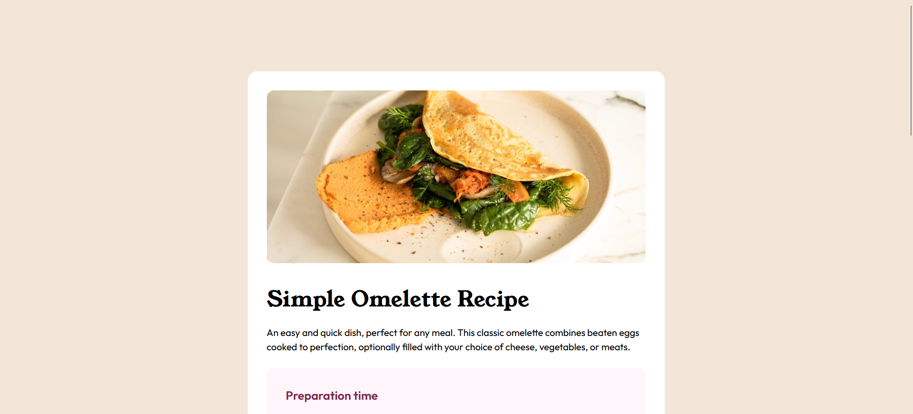

# Frontend Mentor - Recipe page solution

This is a solution to the [Recipe page challenge on Frontend Mentor](https://www.frontendmentor.io/challenges/recipe-page-KiTsR8QQKm). Frontend Mentor challenges help you improve your coding skills by building realistic projects. 

## Table of contents

- [Overview](#overview)
  - [The challenge](#the-challenge)
  - [Screenshot](#screenshot)
  - [Links](#links)
- [My process](#my-process)
  - [Built with](#built-with)
- [Author](#author)
- [Acknowledgments](#acknowledgments)

## Overview

### Screenshot

### Links

- Solution URL: [https://github.com/Ivis1991/recipe-page-main]
- Live Site URL: [https://ivis1991.github.io/Ivis1991/recipe-page-main]

## My process

### Built with

- Semantic HTML5 markup
- CSS custom properties
- Tailwind CSS
- Mobile-first workflow

## Author

- Frontend Mentor - [@Ivis1991](https://www.frontendmentor.io/profile/Ivis1991)

